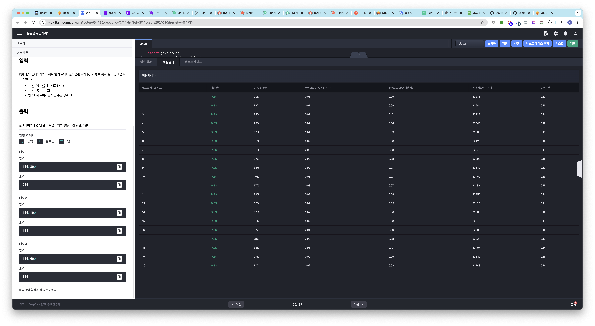

# 알고리즘 미션 - 기초 수학

---

## 운동 중독 플레이어

### 소스코드

```java
import java.io.*;
import java.util.StringTokenizer;
import java.util.Arrays;

class Main {
	public static void main(String[] args) throws Exception {
		int[] input = getInput();
		
		int result = logic(input);
		
		System.out.println(result);
	}
	
	private static int[] getInput() {
		int[] input = new int[2];
		
		try {
			BufferedReader br = new BufferedReader(new InputStreamReader(System.in));
			StringTokenizer st = new StringTokenizer(br.readLine());
			
			input[0] = Integer.parseInt(st.nextToken());
			input[1] = Integer.parseInt(st.nextToken());
		} catch (IOException e) {
			System.out.println(e.getMessage());
		}
		
		return input;
	}
	
	private static int logic(int[] input) {		
		return (int) (input[0] * (1 + input[1] / 30.0));
	}
}
```

### 실행결과



---

## 울타리 치기

### 소스코드


### 실행결과


---

## 여유 황금비

### 소스코드


### 실행결과

