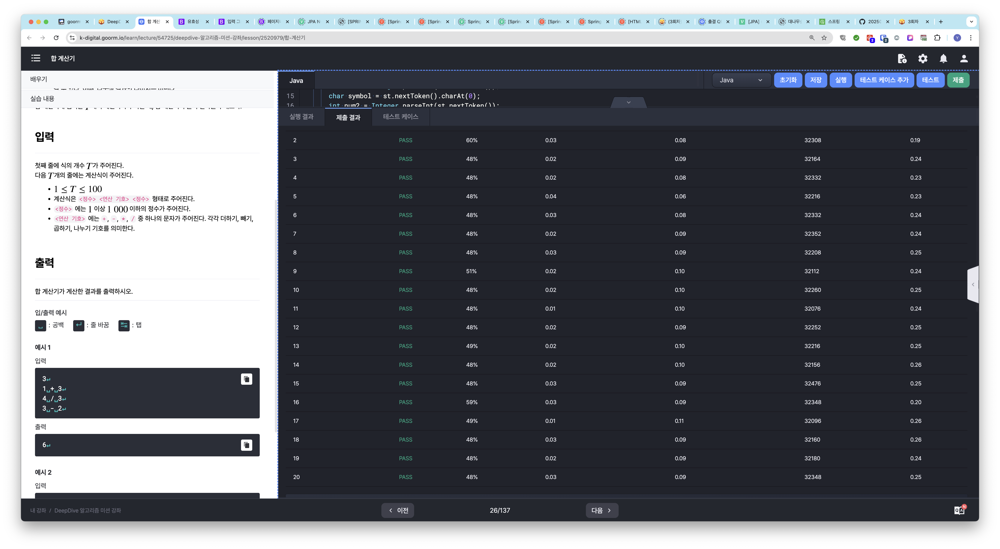
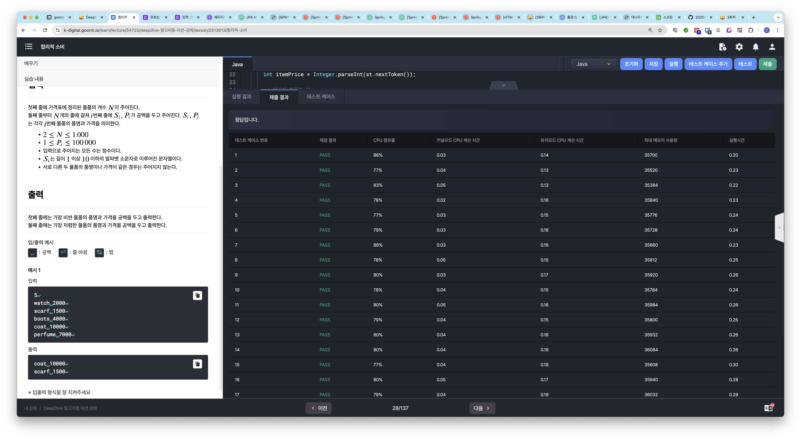

# 알고리즘 미션 - 기초 구현

---

## 합 계산기

### 소스코드

```java
import java.io.*;
import java.util.StringTokenizer;

class Main {
	public static void main(String[] args) throws Exception {
		BufferedReader br = new BufferedReader(new InputStreamReader(System.in));
		int T = Integer.parseInt(br.readLine());
		
		int result = 0;
		
		StringTokenizer st;
		for (int i = 0; i < T; i++) {
			st = new StringTokenizer(br.readLine());
			int num1 = Integer.parseInt(st.nextToken());
			char symbol = st.nextToken().charAt(0);
			int num2 = Integer.parseInt(st.nextToken());
			
			switch(symbol) {
				case '+':
					result += (num1 + num2);
					break;
				case '-':
					result += (num1 - num2);
					break;
				case '*':
					result += (num1 * num2);
					break;
				case '/':
					result += (num1 / num2);
					break;
			}
		}
		
		System.out.println(result);
	}
}
```

### 실행결과



---

## 합리적 소비

### 소스코드

```java
import java.io.*;
import java.util.StringTokenizer;
import java.util.Map;
import java.util.HashMap;

class Main {
	public static void main(String[] args) throws Exception {
		BufferedReader br = new BufferedReader(new InputStreamReader(System.in));
		int N = Integer.parseInt(br.readLine());
		
		String expensiveItemName = "";
		int expensiveItemPrice = 0;
		
		String cheapItemName = "";
		int cheapItemPrice = 0;
		
		StringTokenizer st;
		for (int i = 0; i < N; i++) {
			st = new StringTokenizer(br.readLine());
			
			String itemName = st.nextToken();
			int itemPrice = Integer.parseInt(st.nextToken());
			
			// 첫번째 항목일 때
			if (i == 0) {
				expensiveItemName = itemName;
				expensiveItemPrice = itemPrice;
				
				cheapItemName = itemName;
				cheapItemPrice = itemPrice;
				
				continue;
			}
			
			// 지금까지 나온 물건 중 가장 비쌀 경우
			if (itemPrice > expensiveItemPrice) {
				expensiveItemName = itemName;
				expensiveItemPrice = itemPrice;
				
				continue;
			}
			
			// 지금까지 나온 물건 중 가장 저렴할 경우
			if (itemPrice < cheapItemPrice) {
				cheapItemName = itemName;
				cheapItemPrice = itemPrice;
			}
		}
		
		System.out.println(expensiveItemName + " " + expensiveItemPrice);
		System.out.println(cheapItemName + " " + cheapItemPrice);
	}
}
```

### 실행결과



---

## 과연 승자는?

### 소스코드

```java

```

### 실행결과

