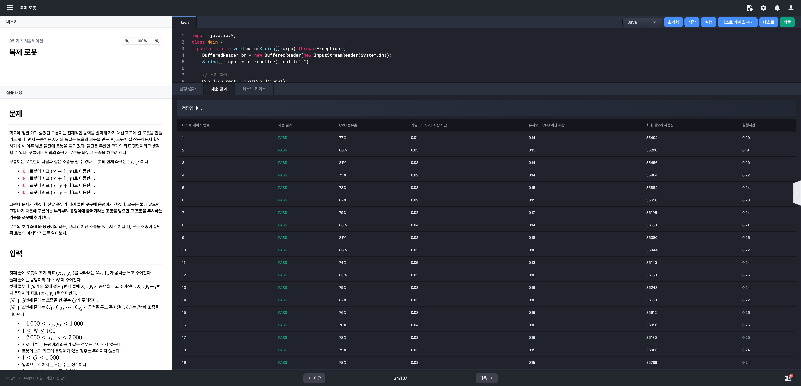
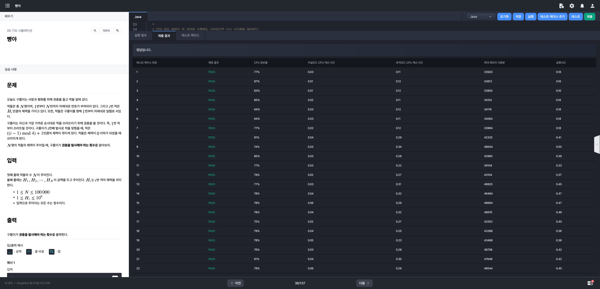

# 알고리즘 미션 - 기초 시뮬레이션

---

## 나무꾼 구름이

### 소스코드

```java
import java.io.*;
import java.util.StringTokenizer;
import java.util.Arrays;

class Main {
	public static void main(String[] args) throws Exception {
		BufferedReader br = new BufferedReader(new InputStreamReader(System.in));
		String[] firstLine = br.readLine().split(" ");
		
		int N = Integer.parseInt(firstLine[0]);			// 나무의 그루 수
		int M = Integer.parseInt(firstLine[1]);			// 벌목 높이 제한
		int X = Integer.parseInt(firstLine[2]) - 1; // 구름이가 위치한 나무
		
		// 초기 나무 높이
		int[] H = Arrays.stream(br.readLine().split(" ")).mapToInt(Integer::parseInt).toArray();
		
		int Q = Integer.parseInt(br.readLine());		// 벌목 횟수
		String[] D = br.readLine().split(" ");			// 이동 방향 배열
		
		long result = 0L;														// 소지 목재량
		
		for (int i = 0; i < Q; i++) {
			if (H[X] + i >= M) {											// 벌목 과정
				result += H[X] + i;
				H[X] -= H[X] + i;
			}

			if (D[i].equals("L")) {										// 이동 과정
				X = (X - 1 + N) % N;
			} else if (D[i].equals("R")) {
				X = (X + 1) % N;
			}
		}
		
		System.out.println(result);
	}
}
```

### 실행결과


---

## 복제 로봇

### 소스코드

```java
import java.io.BufferedReader;
import java.io.InputStreamReader;
import java.util.Arrays;

class Main {
	public static void main(String[] args) throws Exception {
		BufferedReader br = new BufferedReader(new InputStreamReader(System.in));
		int[] input = Arrays.stream(br.readLine().split(" ")).mapToInt(Integer::parseInt).toArray();
		
		Coord current = new Coord(input[0], input[1]);	// 초기 좌표
		int N = Integer.parseInt(br.readLine());				// 웅덩이 개수
		
		Coord[] ponds = new Coord[N];										// 웅덩이 분포 정보
		for (int i = 0; i < N; i++) {
			input = Arrays.stream(br.readLine().split(" ")).mapToInt(Integer::parseInt).toArray();
			ponds[i] = new Coord(input[0], input[1]);
		}
		
		int Q = Integer.parseInt(br.readLine());			  // 조종 횟수
		String[] commands = br.readLine().split(" ");   // 이동 커맨드 정보
		
		// 이동 명령 처리
		for (String command : commands) {
			DestCoord dest = new DestCoord(current.getX(), current.getY());
			if (command.equals("L")) {					// 왼쪽으로 이동
				dest.moveLeft();
				moveToDest(current, dest, ponds);
			} else if (command.equals("R")) {		// 오른쪽으로 이동
				dest.moveRight();
				moveToDest(current, dest, ponds);
			} else if (command.equals("U")) {		// 상단으로 이동
				dest.moveForward();
				moveToDest(current, dest, ponds);
			} else {   													// 하단으로 이동
				dest.moveBack();
				moveToDest(current, dest, ponds);
			}
		}
		
		System.out.println(current.toString());
	}
	
	// 현재 위치 갱신
	private static void moveToDest(Coord current, DestCoord dest, Coord[] ponds) {
		if (!isDestIsPond(dest, ponds)) {
			current.setX(dest.getX());
			current.setY(dest.getY());
		}
	}
  
 	// 가고자 하는 곳이 연못인지 확인
	private static boolean isDestIsPond(DestCoord dest, Coord[] ponds) {
		for (Coord pond : ponds) {
			if (dest.isThisCoordEqual(pond)) {
				return true;
			}
		}
		return false;
	}
	
	// 좌표 정보
	static class Coord {
		int x;
		int y;
		
		public Coord() {
		}
		
		public Coord(int x, int y) {
			this.x = x;
			this.y = y;
		}
		
		public int getX() {
				return x;
			}
			
		public void setX(int x) {
			this.x = x;
		}
			
		public int getY() {
			return y;
		}
			
		public void setY(int y) {
			this.y = y;
		}
			
		public boolean isThisCoordEqual(Coord coord) {
			return this.x == coord.x && this.y == coord.y;
		}
		
		public String toString() {
			return x + " " + y;
		}
	}
	
  // 이동 목표 좌표
	static class DestCoord extends Coord {
		public DestCoord(int x, int y) {
			this.x = x;
			this.y = y;
		}
		
		public void moveLeft() {
			this.x -= 1;
		}
		
		public void moveRight() {
			this.x += 1;
		}
		
		public void moveForward() {
			this.y += 1;
		}
		
		public void moveBack() {
			this.y -= 1;
		}
	}
}
```

### 실행결과



---

## 빵야

### 소스코드

```java
import java.io.*;
import java.util.Arrays;

class Main {
	public static void main(String[] args) throws Exception {
		BufferedReader br = new BufferedReader(new InputStreamReader(System.in));
		int N = Integer.parseInt(br.readLine());
		int[] H = Arrays.stream(br.readLine().split(" ")).mapToInt(Integer::parseInt).toArray();
		
		long totalCnt = 0;
		int damage = 0;
		
		/* 
		 * Key Point. 데미지는 1, 2, 3, 4로 순환한다.
		 *
		 * 우선 한 사이클을 돌려본다. (만약 사이클 중 적의 체력이 0이하로 내려간다면 중단)
		 * 
		 * 한 사이클을 돌려도 체력이 남아있다면 아래 과정을 수행한다.
		 *
		 * 현재 데미지가 1이고 (i가 0) 적의 체력이 health라고 가정한다면
		 * Math.round(health / 10) * 4번의 발사로 Math.round(health / 10) * 10 만큼의 데미지를 입힌다.
		 * 이렇게 될 경우 적의 체력은 health % 10이 된다.
		 * 
		 * 만약 적의 체력이 위 과정을 수행해도 남아있다면 다시 사이클을 돌려본다.
		 */
		
		for (int health : H) {
			// 데미지가 1이 되기 전까지 & 적의 체력이 남아있는 동안 사격
			while (damage > 0 && health > 0) {
				health -= damage + 1;
				damage = (damage + 1) % 4;
				totalCnt++;
			}
			
			// 현재 체력이 0이하일 경우(적이 쓰러졌다면) 다음 적으로 목표 변경
			if (health <= 0) {
				continue;
			}
			
      // 위에서 도출한 수식을 활용하여 체력을 10미만으로 만든다.
			totalCnt += (health / 10) * 4;
			health %= 10;
			
			while (health > 0) {
				health -= damage + 1;
				damage = (damage + 1) % 4;
				totalCnt++;
			}
		}
		
		System.out.println(totalCnt);
	}
}
```

### 실행결과

