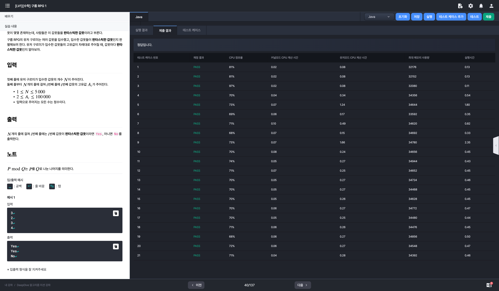

# 알고리즘 미션 - 기초 알고리즘 챌린지

---

## 시간복잡도

### 태그

정수론

### 풀이

- N의 최대값이 10^9 즉 10억 이므로 해당 문제는 long을 사용해도 변수의 표현 가능 범위를 초과하게 된다.
  1. 임의의 정수 X가 있다고 가정할 때 해당 변수의 뒤에 0이 붙기 위해서는 10이 곱해져야 한다.
  2. 10은 2와 5가 곱해져서 도출되는 정수이다.
  3. 따라서 X 뒤에 붙은 0의 개수는 X를 소인수분해 했을 때 5의 개수와 동일하다는 것을 알 수 있다.

- N!을 소인수분해했을 때의 5의 개수 == N을 5로 나눈 몫
  - e.g) 
    - 10!의 5의 뒤에 있는 연속된 0의 개수 = 10 * 9 * 8 * 7 * 6 * 5 * 4 * 3 * 2 * 1 = 3,628,800
    - 10 / 5 = 2
- 이러한 방식으로 입력으로 주어진 N이 5로 더 이상 나누어지지 않을 때까지 반복하면 뒤에 붙은 0의 개수를 도출해낼 수 있다.

### 소스코드

```java
import java.io.*;

class Main {
	public static void main(String[] args) throws Exception {
		BufferedReader br = new BufferedReader(new InputStreamReader(System.in));
		int N = Integer.parseInt(br.readLine()); // 1 <= N <= 10^9(=1000000000)
		int answer = 0;
		
		while (true) {
			if (N <= 0) break;
			
			answer += N / 5;
			N /= 5;
		}
		
		System.out.println(answer);
	}
}
```

### 실행결과


---

## 구름 RPG

### 태그

수학(소수), 에라토스테네스의 체

### 풀이

- 입력 (모두 정수)
  - 갑옷의 개수 N (최소 1, 최대 5,000)
  - N개의 라인의 갑옷 고유값 (최소 2, 최대 100,000)

- 데미지 계산식 (고유값은 항상 2이상의 정수)
  - 나의 체력 H, 나의 갑옷의 고유값(방어력) A, 상대방의 무기의 고유값(공격력) W
  - 아래 두 조건을 만족하면 공격력만큼 체력이 감소한다.
    - A(방어력) > W(공격력)
    - A(방어력) % W(공격력) = 0
  - 위 두 조건을 **모두 만족**하지 않는다면 체력은 감소하지 않는다.
- 판타스틱한 갑옷
  - 어떤 경우에도 체력이 감소하지 않는 갑옷
  - 즉, 갑옷의 고유값(방어력)이 **소수**이면 그 갑옷은 판타스틱한 갑옷이다.

### 소스코드

```java
import java.io.*;

class Main {
	public static void main(String[] args) throws Exception {
		BufferedReader br = new BufferedReader(new InputStreamReader(System.in));
		int N = Integer.parseInt(br.readLine());
		
		StringBuilder sb = new StringBuilder();
		for (int i = 0; i < N; i++) {
			int armor = Integer.parseInt(br.readLine());
			if (isPrime(armor)) {
				System.out.println("Yes");
				continue;
			}
			System.out.println("No");
		}
	}
	
	private static boolean isPrime(int armor) {
		 for (int i = 2; i <= armor / 2; i++){
			 if(armor % i == 0) return false;
		 }
		return true;
	}
}
```

### 실행결과



---

## GameJam

### 소스코드

```java

```

### 실행결과

